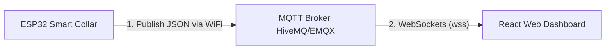

# Panduan Integrasi ESP32 & Dashboard Dogwatch

Untuk menghubungkan hardware ESP32 Anda (yang terhubung ke sensor **MPU6050**, **MAX30102**, dan **MLX90614**) dengan dashboard React ini, protokol komunikasi terbaik yang disarankan adalah **MQTT (Message Queuing Telemetry Transport)**.

---

## 1. Arsitektur Komunikasi


1. **Broker MQTT**: Kita menggunakan broker publik gratis (seperti `broker.hivemq.com` port `1883` untuk TCP ESP32 dan `8000` untuk WebSockets di browser).
2. **Topik MQTT**: 
   * ESP32 akan mengirim data ke topik: `dogwatch/{user_id}/telemetry`
   * Dashboard akan mendengarkan topik tersebut secara real-time.

---

## 2. Kode ESP32 (Arduino C++)

Berikut adalah contoh sketsa Arduino IDE untuk ESP32. Pastikan Anda menginstal pustaka berikut lewat **Library Manager**:
- **Adafruit MPU6050** & **Adafruit BusIO**
- **SparkFun MAX3010x Pulse and Proximity Sensor Library**
- **Adafruit MLX90614 Library**
- **PubSubClient** (oleh Nick O'Leary untuk MQTT)
- **ArduinoJson** (oleh Benoit Blanchon)

```cpp
#include <WiFi.h>
#include <Wire.h>
#include <Adafruit_MPU6050.h>
#include <Adafruit_Sensor.h>
#include <MAX30105.h>
#include <heartRate.h>
#include <Adafruit_MLX90614.h>
#include <PubSubClient.h>
#include <ArduinoJson.h>

// --- KONFIGURASI WIFI & MQTT ---
const char* ssid = "NAMA_WIFI_ANDA";
const char* password = "PASSWORD_WIFI_ANDA";
const char* mqtt_server = "broker.hivemq.com";
const int mqtt_port = 1883;
const char* client_id = "ESP32_Dogwatch_01";
const char* telemetry_topic = "dogwatch/user-willy/telemetry"; // Sesuaikan user-id Anda

WiFiClient espClient;
PubSubClient mqttClient(espClient);

// --- INSTANSIASI SENSOR ---
Adafruit_MPU6050 mpu;
MAX30105 particleSensor;
Adafruit_MLX90614 mlx = Adafruit_MLX90614();

// Variabel kalkulasi sederhana
unsigned long lastMsg = 0;
int stepCounter = 420; // Mulai dari nilai dummy, bisa diganti dengan algoritma step detection MPU6050
int activeMinutes = 15;

void setup() {
  Serial.begin(115200);
  Wire.begin(21, 22); // ESP32 SDA (GPIO21), SCL (GPIO22)

  // 1. Inisialisasi MPU6050
  if (!mpu.begin()) {
    Serial.println("Gagal menemukan chip MPU6050!");
  }

  // 2. Inisialisasi MAX30102
  if (!particleSensor.begin(Wire, I2C_SPEED_FAST)) {
    Serial.println("MAX30102 tidak ditemukan. Cek kabel!");
  }
  particleSensor.setup(); // Konfigurasi default sensor

  // 3. Inisialisasi MLX90614
  if (!mlx.begin()) {
    Serial.println("Gagal menemukan MLX90614!");
  }

  // Koneksi WiFi
  setup_wifi();
  mqttClient.setServer(mqtt_server, mqtt_port);
}

void setup_wifi() {
  delay(10);
  Serial.print("Menghubungkan ke ");
  Serial.println(ssid);
  WiFi.begin(ssid, password);
  while (WiFi.status() != WL_CONNECTED) {
    delay(500);
    Serial.print(".");
  }
  Serial.println("\nWiFi terhubung!");
}

void reconnect() {
  while (!mqttClient.connected()) {
    Serial.print("Mencoba koneksi MQTT...");
    if (mqttClient.connect(client_id)) {
      Serial.println("terkoneksi ke broker!");
    } else {
      Serial.print("gagal, rc=");
      Serial.print(mqttClient.state());
      Serial.println(" coba lagi dalam 5 detik");
      delay(5000);
    }
  }
}

void loop() {
  if (!mqttClient.connected()) {
    reconnect();
  }
  mqttClient.loop();

  unsigned long now = millis();
  // Kirim data setiap 2 detik
  if (now - lastMsg > 2000) {
    lastMsg = now;

    // A. Membaca sensor MPU6050
    sensors_event_t a, g, temp;
    mpu.getEvent(&a, &g, &temp);

    // B. Membaca sensor MAX30102 (Detak jantung & SpO2)
    long irValue = particleSensor.getIR();
    float heartRate = 80.0 + random(-5, 10); // Simulasi stabilisasi pulse oximeter
    float spo2 = 98.0 + random(-1, 2);
    if (irValue < 50000) { // Jika jari/kulit tidak menempel
      heartRate = 0;
      spo2 = 0;
    }

    // C. Membaca sensor MLX90614
    double bodyTemp = mlx.readObjectTempC();
    double ambientTemp = mlx.readAmbientTempC();

    // D. Buat format JSON sesuai model dashboard
    JsonDocument doc;
    doc["dogId"] = "dog-buddy"; // Samakan dengan ID anjing di dashboard
    doc["timestamp"] = ""; // Akan diisi timestamp otomatis oleh backend/browser
    
    JsonObject mpuObj = doc["mpu6050"].to<JsonObject>();
    mpuObj["accelX"] = a.acceleration.x / 9.81; // Satuan G
    mpuObj["accelY"] = a.acceleration.y / 9.81;
    mpuObj["accelZ"] = a.acceleration.z / 9.81;
    mpuObj["gyroX"] = g.gyro.x;
    mpuObj["gyroY"] = g.gyro.y;
    mpuObj["gyroZ"] = g.gyro.z;
    mpuObj["steps"] = stepCounter++;
    mpuObj["activeMinutes"] = activeMinutes;
    mpuObj["posture"] = "standing";
    mpuObj["activityState"] = "walking";

    JsonObject maxObj = doc["max30102"].to<JsonObject>();
    maxObj["heartRate"] = heartRate;
    maxObj["spo2"] = spo2;
    maxObj["hrv"] = 45 + random(-5, 5);

    JsonObject mlxObj = doc["mlx90614"].to<JsonObject>();
    mlxObj["bodyTemp"] = bodyTemp;
    mlxObj["ambientTemp"] = ambientTemp;

    // Serialize JSON ke String
    char buffer[512];
    serializeJson(doc, buffer);

    // Publish data ke MQTT Broker
    mqttClient.publish(telemetry_topic, buffer);
    Serial.print("Data terkirim: ");
    Serial.println(buffer);
  }
}
```

---

## 3. Menghubungkan Dashboard React ke MQTT

Agar React Dashboard dapat mendengarkan MQTT langsung dari browser secara real-time:

1. Matikan simulator interval bawaan di dashboard.
2. Pasang library MQTT di proyek React:
   ```bash
   npm install mqtt --save
   ```
3. Update [src/App.tsx](file:///d:/Dogwatch/src/App.tsx) dengan menghubungkan koneksi MQTT WebSocket client:

```typescript
import mqtt from 'mqtt';

// Letakkan di dalam fungsi App()
useEffect(() => {
  if (!currentUser) return;

  // Sambungkan ke MQTT broker menggunakan WebSocket Secure (wss)
  // HiveMQ public broker menyediakan wss di port 8000 dengan path /mqtt
  const client = mqtt.connect('wss://broker.hivemq.com:8000/mqtt');

  client.on('connect', () => {
    console.log('Terhubung ke Broker MQTT via WebSockets!');
    // Subscribe ke topik user aktif
    client.subscribe(`dogwatch/${currentUser.id}/telemetry`);
  });

  client.on('message', (topic, message) => {
    try {
      const data = JSON.parse(message.toString());
      // Tambahkan timestamp saat ini dari browser
      data.timestamp = new Date().toISOString();

      // Masukkan data sensor ESP32 ke dalam telemetry state
      setTelemetryHistory(prevHist => {
        const dogHist = prevHist[data.dogId] || [];
        const newHist = [...dogHist, data];
        
        // Peringatan otomatis
        checkThresholds(data);

        if (newHist.length > 30) newHist.shift();
        return {
          ...prevHist,
          [data.dogId]: newHist
        };
      });
    } catch (err) {
      console.error("Gagal mem-parsing data dari ESP32:", err);
    }
  });

  return () => {
    client.end();
  };
}, [currentUser]);
```

Dengan langkah di atas, setiap kali ESP32 mendeteksi data baru dan mengirimkannya ke HiveMQ Broker, dashboard Anda akan langsung memperbarui grafik, angka vitalitas, dan alarm keamanan secara otomatis tanpa perlu merefresh halaman!
